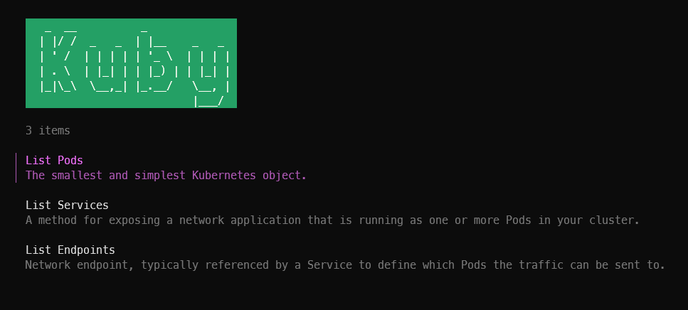

# Kuby

Very simple CLI visualization of Kubernetes resources.

## Credit

- [Design Inspiration](https://github.com/piotrpdev/songs-app) (and [k9s](https://github.com/derailed/k9s) and [bubbletea examples](https://github.com/charmbracelet/bubbletea/tree/master/examples))
- [Kubernetes API](https://kubernetes.io/docs/reference/kubernetes-api/)
- [Example code](https://github.com/kubernetes/client-go/blob/master/examples/out-of-cluster-client-configuration/main.go)
- [Kind kubeconfig help](https://stackoverflow.com/a/66274247)
  - `sudo kubectl config view --flatten >> ~/.kube/config`